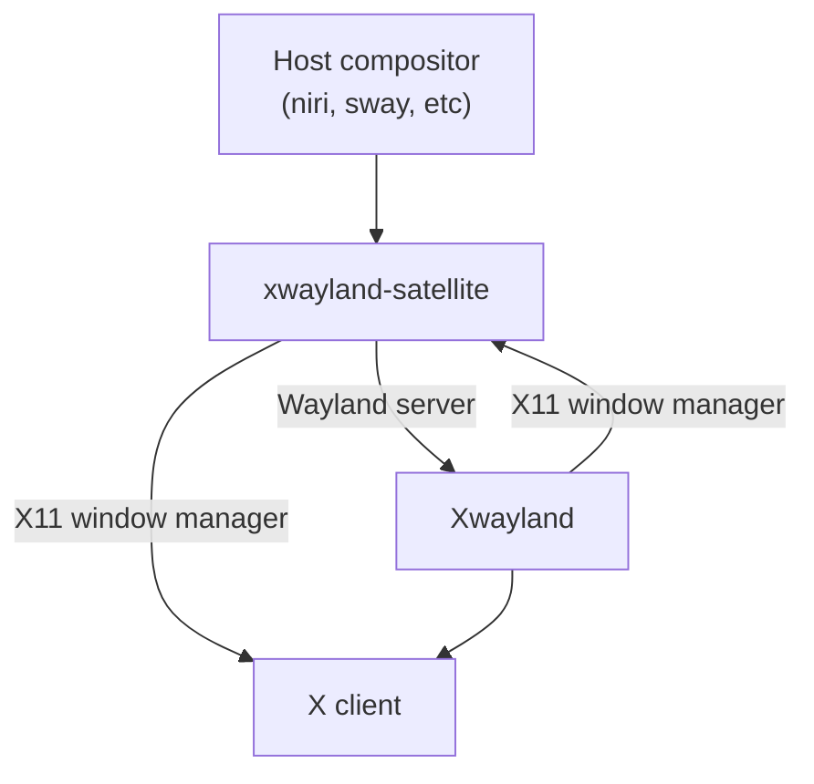

# Architecture

This is a high level overview of the architecture of xwayland-satellite. It has a
few different roles that can be confusing to understand if you aren't familiar with
how Wayland and X11 function.

## Overview

xwayland-satellite grants rootless Xwayland integration to any standard Wayland compositor through standard
Wayland protocols. As such, this means satellite has to function as three different things:

1. An X11 window manager
2. A Wayland client
3. A Wayland server/compositor

### X11 window manager

The code for the X11 portion of satellite lives in `src/xstate`. Satellite must function largely the same way
as any other standard X11 window manager. This includes:

- Setting SubstructureRedirect and SubstructureNotify on the root window, to get notifications for when new windows are being created
- Follwing (most of) the [ICCCM](https://www.x.org/releases/X11R7.6/doc/xorg-docs/specs/ICCCM/icccm.html) and [EWMH](https://specifications.freedesktop.org/wm-spec/latest/) specs

In addition, satellite must do some other things that a normal X11 window manager wouldn't - but a compositor integrating
Xwayland would - such as synchronize X11 and Wayland selections. This is explained further in the Wayland server section.

The way that satellite manages windows from the X11 point of view is as follows:

- All toplevels on a monitor are positioned at 0x0 on that monitor. So if you have one monitor at 0x0,
all the windows are located at 0x0. If you have a monitor at 300x600, all the windows on that monitor are at 300x600.
    - This offset is needed because all monitors rest in the same coordinate plane in X11, so missing this offset would
    would lead to incorrect cursor behavior.
- The current window that the mouse is hovering over is raised to the top of the stack.
- Any window determined to be a popup (override redirect, EWMH properties, etc) has its position respected if there is
an existing toplevel. If there is no existing toplevel, the window is treated as a toplevel.

This approach seems to work well for most applications. The biggest issues will be applications that rely on creating windows
at specific coordinates - for example Steam's notifications that slide in from the bottom of the screen.

### Wayland client

Since satellite is intended to function on any Wayland compositor implementing the necessary protocols,
it functions as a Wayland client. This is straightforward to think about. Client interfacing code lives in
`src/clientside`, as well as being interspersed throughout `src/server`.

### Wayland server

In order to interface with Xwayland, which itself is a Wayland client, satellite must function as a Wayland server.
The code for this lives in `src/server`. Satellite will re-expose relevant Wayland interfaces from the host compositor
(the compositor that satellite itself is a client to) back to Xwayland.

A lot of the interfaces that Xwayland is interested in can be exposed directly from the host with no further changes,
in which case satellite is just acting as an interface passthrough. However, some interfaces need to be manipulated
or otherwise intercepted for proper functionality, such as:

- `wl_surface` - Xwayland simply exposes all X11 windows as `wl_surface`s, but for standard desktop compositors to actually show something,
these surfaces must have roles, such as `xdg_toplevel` and `xdg_popup` and friends
- `xdg_output` - Xwayland will use `xdg_output`'s logical size for sizing the X11 screen, but this leads to the wrong size
when the output is scaled, and blurry windows as you may have seen in other Xwayland integrations.
- `wl_pointer` - For handling scaled mouse output, since we are changing the reported output/surface sizes.

Note that there may be some interfaces that are only used from satellite's client side, such as `xdg_wm_base`. These
are interfaces that Xwayland is not actually interested in, but satellite itself uses to provide some sort of functionality
- satellite is a normal Wayland client after all.
